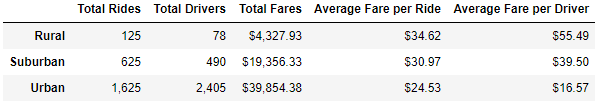
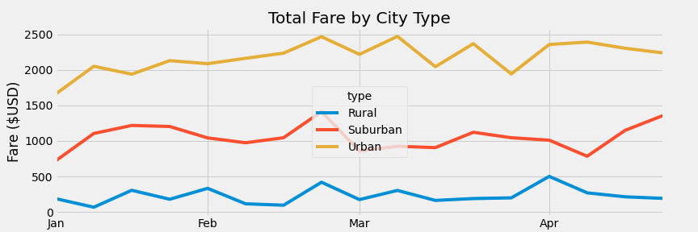

# PyBer_Analysis

## Overview
The purpose of this challenge was to create a dataframe of PyBer ride sharing by city type. Using pnadas/matplotlip, a line graph was created to show weekly fares based on city type and time of year.

## Results
When looking at the analysis of the PyBer summary created, it can be noted that as the number of rides increase the average fare for each ride goes down. Looking at this data in a vacuum one could come to the conclusion that this could be due to the lower amount of drivers or rides in rural areas that could potentially be responsible for higher average fares, as opposed to an urban area where there are more drivers available and a higher amount of rides.

Something that is not considered within this dataset is the amount of distance travelled. This could heavily affect data as it might be assumed the urban settings would have less distance to travel when compared to rural settings.

Total fares would be expected to increase with population which is what you see in the "Total Fare by City Type" chart below. With both more people available to be drivers and more demand for drivers the amount of rides occuring would increase in a more populated (urban) setting versus a less populated (rural) setting.

## Summary
Overall there is a drastic difference between city types with urban settings having the highest total fares, and rural settings having the highest average fares. A suggestion for PyBer might be for more focus on densely populated areas in terms of promotions. While pricing may be more appealing for rural areas for PyBer, the clientelle is more sparce and retaining customers may prove more difficult. Focusing on retention of repeat customers will show increased profits in the long term.

Another recommendation may be to offer incentives during low traffic times to increase the volume of customers during this time. There are certain times that appear to have variability within the total fares, smoothing the curve by allowing certain customers who may not usually use PyBer to try it out for a reduced cost may incentivize them to continue using PyBer.

A final recommendation may be to make drivers more exclusive in urban areas. The total amount of drivers exceeded the total rides in urban settings leading to some wasted costs if those drivers still needed to be paid per contract.
